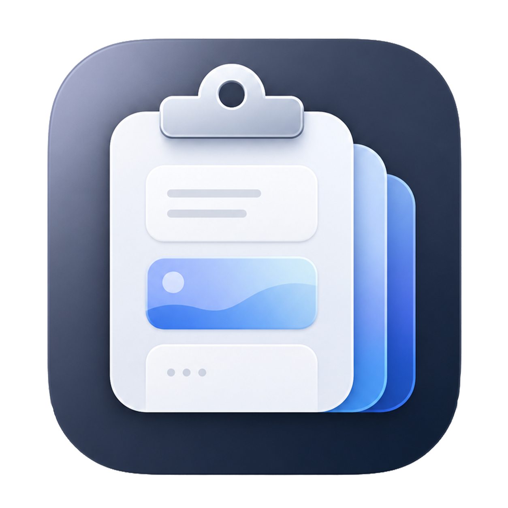

<p align="center">
  
</p>

<h1 align="center">LimiClip</h1>

<p align="center"><strong>The clipboard manager that gets out of your way.</strong></p>

<p align="center">
  
  
  
  
</p>

LimiClip sits in your menu bar and captures every text snippet, image, and file you copy. Press ⌘⇧V and your full history slides up as a searchable card strip — navigate with arrow keys, paste with Return, never retype the same thing twice. It also captures and annotates screenshots, records the screen, and chains copies together. No Dock icon, no subscription, no cloud.

---

**A bottom drawer, always at hand**&nbsp;&nbsp;&nbsp;&nbsp;⌘⇧V raises a card strip from the screen edge. Filter by All / Text / Images / Files / Videos / Pinned. Jump between items with arrow keys or ⌘1–⌘9. Paste with Return. Dismiss with Esc. It's gone the moment you don't need it.

**Compact popup**&nbsp;&nbsp;&nbsp;&nbsp;A cursor-adjacent 10-item popup on a configurable shortcut — grab and paste without the full drawer ever opening.

**Pin what matters**&nbsp;&nbsp;&nbsp;&nbsp;Right-click any card → Pin. Pinned items live in their own tab and survive every retention purge, indefinitely.

**Images and files, not just text**&nbsp;&nbsp;&nbsp;&nbsp;Captures images copied from any app and records file paths for dragged files — all browsable and re-pastable from the drawer.

**Capture & annotate**&nbsp;&nbsp;&nbsp;&nbsp;⌘⇧A dims the live screen for a crosshair region select, freezes it, and docks a markup drawer right to your selection: **pen, arrow, rectangle, text**, with color and thickness. Finish with ⌘C (copy), ⌘S (save to a folder), or ⌘⇧S (save to history). Annotate any image already in the drawer via right-click → Annotate.

**Screen recording**&nbsp;&nbsp;&nbsp;&nbsp;Record a region or the full screen with a 3-2-1 countdown and a menu-bar Stop control. Clips save to `~/Movies/LimiClip_Recordings` (or any folder you choose) and appear in the **Videos** tab with a thumbnail, play badge, and duration — Play, Reveal in Finder, or Copy. Optional microphone audio.

**Chain copy**&nbsp;&nbsp;&nbsp;&nbsp;A configurable hotkey appends the current selection to the clipboard text, space-separated — copy `hi`, chain-copy `mister`, get `hi mister`. Keep going to build up a line.

**Quick Actions**&nbsp;&nbsp;&nbsp;&nbsp;NSDataDetector surfaces actionable context menus for detected phone numbers (Call), email addresses (Compose), and hex colors (Copy). One click from history, straight to action.

**App Exclusions**&nbsp;&nbsp;&nbsp;&nbsp;Privacy pane in Preferences lets you block any app by bundle — 1Password, banking apps, anything you never want recorded. Built-in seed list for common password managers.

**Configurable retention**&nbsp;&nbsp;&nbsp;&nbsp;Set a max history count and a max item age. Pinned items are exempt from all automatic purges.

**Notarized & Gatekeeper-safe**&nbsp;&nbsp;&nbsp;&nbsp;Signed with a Developer ID Application certificate and notarized by Apple — no "unidentified developer" warning on first launch.

---

## Installation

**Download the latest release:**

→ **[LimiClip-0.6.1.dmg](https://github.com/Galev01/LimiClip/releases/latest)**

1. Open the `.dmg` and drag **LimiClip** into your `/Applications` folder.
2. Launch LimiClip from Applications or Spotlight.
3. LimiClip appears in your **menu bar** — there is no Dock icon.

### First-time setup — permissions

- **Accessibility** — LimiClip synthesizes ⌘V (paste) and ⌘C (chain copy). On first launch a permission banner appears in the drawer; click it to open **System Settings → Privacy & Security → Accessibility** and enable LimiClip.
- **Screen Recording** — needed for ⌘⇧A capture and screen recording. macOS prompts the first time you use either.
- **Microphone** — only prompted if you turn on recording audio (Preferences → General → Recording).

You only grant these once.

---

## Keyboard Shortcuts

All shortcuts are fully reconfigurable in **Preferences → Shortcuts** (⌘,).

| Action | Default |
|--------|---------|
| Toggle Clipboard Drawer | ⌘⇧V |
| Capture & Annotate Region | ⌘⇧A |
| Open Compact Popup | *(unset — configure in Preferences)* |
| Start / Stop Recording | *(unset — configure in Preferences)* |
| Chain Copy (append selection) | *(unset — configure in Preferences)* |
| Navigate items | ↑ / ↓ |
| Paste focused item | Return |
| Jump to item 1–9 | ⌘1 – ⌘9 |
| Delete item | ⌫ |
| Close Drawer / Popup | Esc |
| Open Preferences | ⌘, |

In the annotation editor: **⌘C** copy · **⌘S** save to folder · **⌘⇧S** save to history · **⌘Z** undo · **Esc** cancel.

---

## Building from Source

**Requirements:** macOS 14+, Xcode 16+, [XcodeGen](https://github.com/yonaskolb/XcodeGen)

```bash
# Install XcodeGen if needed
brew install xcodegen

git clone https://github.com/Galev01/LimiClip.git
cd LimiClip

make build    # generates Xcode project and builds
make test     # runs the full test suite
make run      # build + launch
```

The Xcode project (`ClipboardManager.xcodeproj`) is generated from `project.yml` via XcodeGen and is not committed to the repo.

For a notarized distribution build, see [DISTRIBUTION.md](DISTRIBUTION.md).

---

## Contributing

Pull requests are welcome. For significant changes, open an issue first to discuss what you'd like to change. The project uses TDD — all new code should come with tests.

---

## License

MIT — see [LICENSE](LICENSE).
